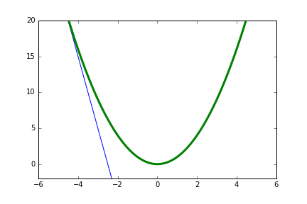
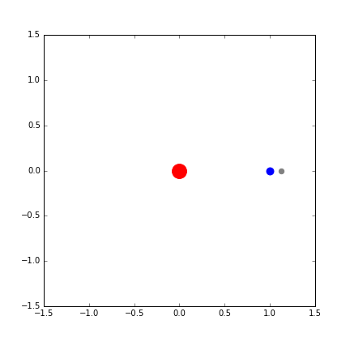

# ipython_notebook_animations
IPython上でmatplotlibとmatplotlib.animation.FuncAnimationを利用して、IPython内やMP4、GIF等に描画するコードです。生成できる動画は以下のようなものです。  

## 二乗関数と接線(Square function and tangent)  

## いくつかの勾配降下法
### 勾配降下法(Gradient descent) 

### 確率的勾配降下法(Stochastic gradient descent)

### ミニバッチ確率的勾配降下法(Minibatch SGD)

## 太陽と地球と月(Sun,earth,moon)

  
